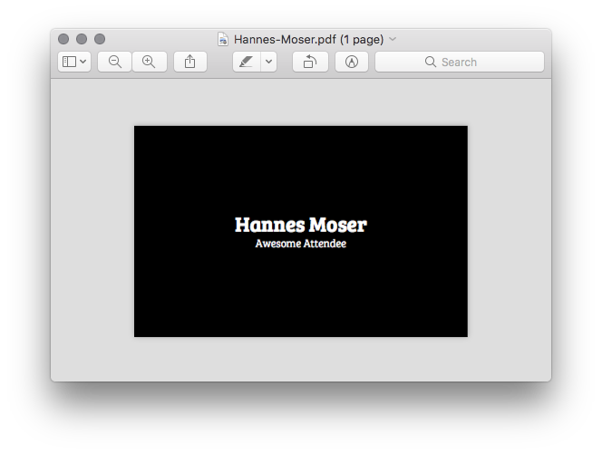

# plastic

> The .concat() card printing software.



## Setup

```bash
npm install
```

## Templates

You can create new templates by adding a `template.hbs` and `style.css` inside a new
directory within `templates`. The `options.json` defines print format and several other
options ([Read more](https://www.npmjs.com/package/html-pdf#options)).

**Example:**

```bash
templates
└── letter
    ├── options.json
    ├── style.css
    ├── template.hbs
    └── template.html
```

### Available templates

* **credit-card**

## Run

### print &lt;printer&gt; &lt;template&gt; &lt;name&gt;

List available printers. Use either `name` or `ID` for print jobs.

**Example:**

```bash
./index.js printer
```

**Output:**

```bash
╔════╤═══════════════════════════╗
║ ID │ Name                      ║
╟────┼───────────────────────────╢
║ 0  │ FollowMe                  ║
╟────┼───────────────────────────╢
║ 1  │ HP_LaserJet_M102w_A4FE28_ ║
╟────┼───────────────────────────╢
║ 2  │ ZEBRA_CARD_PRINTER_ZXP32  ║
╚════╧═══════════════════════════╝
```

### printers|ps &lt;printer&gt; &lt;template&gt; &lt;name&gt;

List of available printers

**Arguments:**

* **--printer|p** Printer ID
* **--output|o** File path
* **template** Template name
* **name** Name to print

**Example:**

```bash
./index.js print 2 "credit-card" "The name"
```

### print|p &lt;printer&gt; &lt;template&gt; &lt;name&gt;

Print name. You can select printer and template.

**Arguments:**

* **--printer|p** Printer ID
* **--output|o** File path
* **template** Template name
* **name** Name to print

**Example:**

```bash
./index.js print 2 "credit-card" "The name"
```